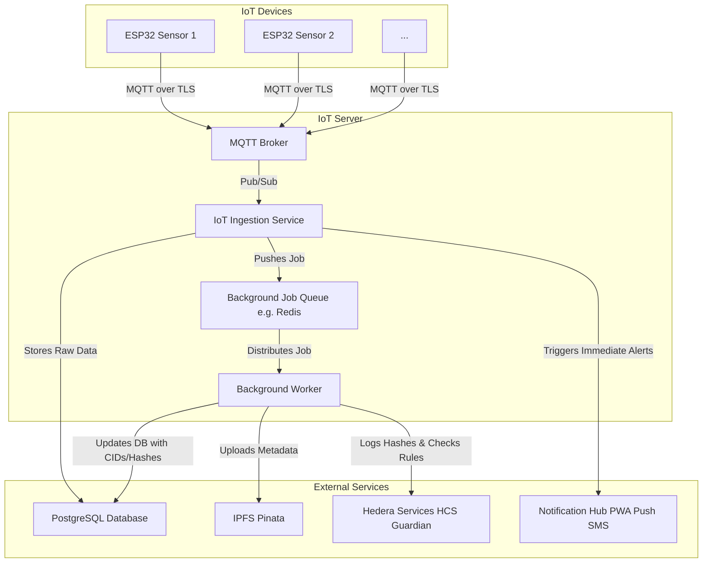

# Heru IoT Server

The Heru IoT Server is the central nervous system for ingesting, processing, and securing data from our cold chain monitoring devices. It is designed to be robust, scalable, and secure, ensuring that every piece of sensor data is reliably handled and recorded on a tamper-proof ledger.

## Architecture

The server is composed of several microservices that work in concert to handle the data flow from IoT devices to external services like databases and blockchain ledgers.



## Core Components

### 1. MQTT Broker
- **Purpose**: The primary entry point for all data from IoT sensors.
- **Technology**: A secure MQTT broker that accepts connections over TLS.
- **Flow**: Receives data from numerous ESP32 sensors and publishes it to specific topics for consumption by the ingestion service.

### 2. IoT Ingestion Service
- **Purpose**: To consume, validate, and route incoming sensor data.
- **Flow**:
    - Subscribes to the MQTT Broker to receive real-time sensor readings.
    - Immediately stores the raw, unprocessed data into the **PostgreSQL Database** for auditing and historical tracking.
    - Analyzes data against predefined rules. If a rule is breached (e.g., temperature out of range), it triggers an immediate alert via the **Notification Hub**.
    - Pushes a job containing the data to the **Background Job Queue** for more intensive, asynchronous processing.

### 3. Background Job Queue
- **Purpose**: To decouple the real-time ingestion service from slower, more complex processing tasks.
- **Technology**: A robust queueing system like Redis.
- **Flow**: Receives jobs from the ingestion service and distributes them to available background workers, ensuring reliable, at-least-once processing.

### 4. Background Worker
- **Purpose**: To perform heavy-lifting tasks that involve external services, ensuring data is permanently and transparently recorded.
- **Flow**:
    - Picks up a job from the queue.
    - Uploads the sensor data and its associated metadata to **IPFS** via the Pinata service, generating a unique Content ID (CID).
    - Logs the data hash and the IPFS CID to **Hedera Services** using the Guardian policy engine. This creates an immutable, verifiable audit trail.
    - Updates the record in the **PostgreSQL Database** with the corresponding IPFS CID and Hedera transaction hash, linking the raw data to its decentralized proof.

## External Services

The IoT Server relies on the following external services:

- **PostgreSQL Database**: The primary datastore for raw sensor data and the metadata (CIDs, hashes) generated by the background worker.
- **IPFS (via Pinata)**: A decentralized storage network used to store sensor data in a tamper-proof manner.
- **Hedera Services (HCS & Guardian)**: A distributed ledger used to create an immutable audit trail of data hashes and enforce compliance rules.
- **Notification Hub**: A service responsible for dispatching real-time alerts via Push Notifications, SMS, or other channels.

## Getting Started

### Prerequisites
- Python 3.11+
- Docker & Docker Compose
- API credentials for Pinata and Hedera (optional for testing)

> [!NOTE]
> The IoT Server is **optional** and only required if you're monitoring temperature-sensitive medicines. Heru can run without IoT sensors for general pharmaceutical tracking.

### Installation

1.  **Navigate to the IoT Server directory**:
    ```bash
    cd "IoT Server"
    ```

2.  **Set up environment variables**:
    Copy the example file and populate it with your credentials:
    ```bash
    cp .env.example .env
    ```
    
    Edit `.env` with your settings:
    ```env
    DATABASE_URL="postgresql+asyncpg://user:password@db/heru_iot"
    REDIS_URL="redis://redis:6379"
    MQTT_BROKER="mqtt"
    PINATA_API_KEY="your_key"
    PINATA_API_SECRET="your_secret"
    HEDERA_ACCOUNT_ID="0.0.XXXX"
    HEDERA_PRIVATE_KEY="your_key"
    HEDERA_TOPIC_ID="0.0.YYYY"
    ```

3.  **Start the server stack** (includes MQTT, Redis, PostgreSQL, Web API, and Worker):
    ```bash
    docker-compose up --build
    ```

4.  **Verify the server is running**:
    ```bash
    curl http://localhost:8000/health
    ```

### Setting Up IoT Sensors

For instructions on flashing and configuring ESP32 sensors, see the [IoT Firmware README](../IoT%20Firmware/README.md).
