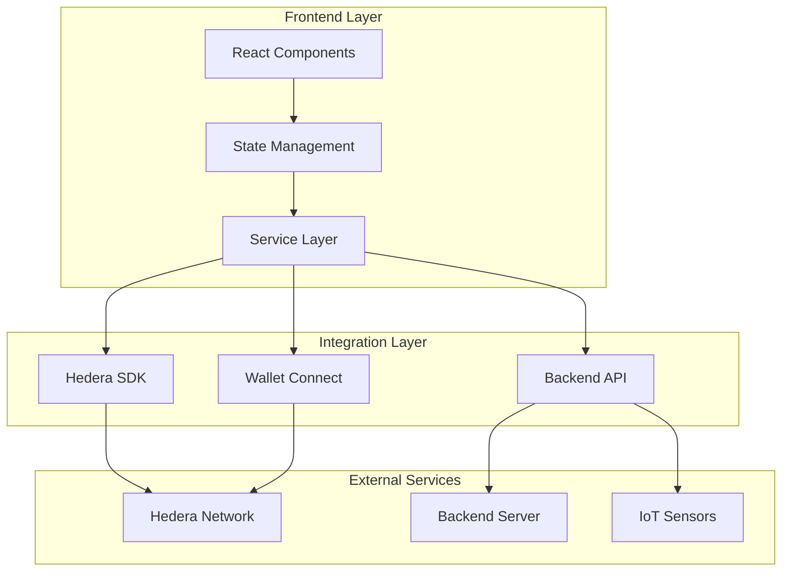

# Heru Frontend 🦅
**Modern Web Interface for Pharmaceutical Cold Chain Management**

[](https://reactjs.org/)
[](https://www.typescriptlang.org/)
[](https://vitejs.dev/)
[](https://tailwindcss.com/)

---

## 🎯 Overview

The Heru Frontend is a cutting-edge Progressive Web Application (PWA) that provides a beautiful, intuitive interface for managing pharmaceutical cold chain operations. Built with modern web technologies, it offers real-time monitoring, blockchain verification, and comprehensive analytics for ensuring medicine integrity from manufacturer to patient.

## ✨ Key Features

### 🏥 For Healthcare Providers
- **Real-time Dashboard**: Monitor all shipments and their compliance status
- **QR Code Verification**: Instantly verify medicine authenticity and temperature history
- **Mobile-First Design**: Optimized for tablets and smartphones
- **Offline Capability**: Core functions work without internet connectivity

### 🚚 For Distributors
- **Shipment Tracking**: Live monitoring of temperature, location, and compliance
- **IoT Integration**: Real-time sensor data visualization
- **Alert Management**: Immediate notifications for cold chain violations
- **Blockchain Proof**: Immutable records on Hedera network

### 📊 For Administrators
- **Analytics Dashboard**: Comprehensive insights into cold chain performance
- **Batch Management**: Track medicine batches from production to delivery
- **Compliance Reports**: Automated regulatory compliance documentation
- **Smart Contract Integration**: Automated escrow and payment systems

## 🏗️ Architecture



## 🚀 Quick Start

### Prerequisites
- Node.js 18+ ([Download](https://nodejs.org/))
- npm or yarn
- Git

### Installation

1. **Clone the Repository**
   ```bash
   git clone https://github.com/your-username/heru.git
   cd heru/heru-web
   ```

2. **Install Dependencies**
   ```bash
   npm install
   ```

3. **Set Up Environment Variables**
   ```bash
   cp .env.example .env
   ```
   
   Edit `.env` with your configuration:
   ```env
   VITE_HEDERA_NETWORK=testnet
   VITE_BACKEND_URL=http://localhost:3001
   VITE_WALLET_CONNECT_PROJECT_ID=your_project_id
   ```

4. **Start Development Server**
   ```bash
   npm run dev
   ```
   
   Frontend will be available at: http://localhost:5173

5. **Start Backend (Optional)**
   ```bash
   npm run backend:dev
   ```

6. **Run Full Stack**
   ```bash
   npm run dev:full
   ```

## 📁 Project Structure

```
heru-web/
├── src/
│   ├── components/       # Reusable UI components
│   │   ├── ui/          # shadcn/ui components
│   │   └── ...          # Custom components
│   ├── pages/           # Page components
│   ├── services/        # Business logic & API integration
│   ├── hooks/           # Custom React hooks
│   ├── lib/             # Utility functions
│   └── assets/          # Static assets
├── backend/             # Backend server (SQLite)
├── contracts/           # Solidity smart contracts
├── public/              # Public static files
└── scripts/             # Build and deployment scripts
```

## 🛠️ Technology Stack

### Core Framework
- **React 18.3**: Modern UI library with hooks
- **TypeScript 5.8**: Type-safe development
- **Vite 5.4**: Lightning-fast build tool
- **React Router 6**: Client-side routing

### UI & Styling
- **Tailwind CSS 3.4**: Utility-first CSS framework
- **shadcn/ui**: High-quality component library
- **Framer Motion**: Smooth animations
- **Lucide React**: Beautiful icon set

### Blockchain Integration
- **Hedera SDK**: Native Hedera Hashgraph integration
- **HashConnect**: Wallet connection library
- **WalletConnect**: Multi-wallet support

### State & Data
- **TanStack Query**: Server state management
- **React Hook Form**: Form handling
- **Zod**: Schema validation

### Charts & Visualization
- **Recharts**: Data visualization
- **QR Code React**: QR code generation/scanning

## 📊 Available Scripts

```bash
# Development
npm run dev              # Start dev server
npm run dev:full         # Start frontend + backend

# Backend
npm run backend          # Start backend server
npm run backend:dev      # Start backend with auto-reload
npm run backend:seed     # Seed demo data

# Build
npm run build            # Production build
npm run build:dev        # Development build
npm run preview          # Preview production build

# Code Quality
npm run lint             # Run ESLint

# Full Setup
npm run setup            # Install backend deps + init DB + seed data
```

## 🎨 Design System

Heru uses a modern, premium design system with:
- **Glassmorphism effects** for depth and elegance
- **Smooth micro-animations** for enhanced UX
- **Responsive layouts** for all screen sizes
- **Dark/Light mode** support (coming soon)
- **Accessibility-first** components

## 🔐 Security Features

- **Wallet-based Authentication**: Secure login via Hedera wallets
- **End-to-end Encryption**: All sensitive data encrypted
- **Role-based Access Control**: Granular permissions
- **Audit Trails**: Complete action logging
- **Input Validation**: Comprehensive data validation

## 🌐 Browser Support

- Chrome/Edge 90+
- Firefox 88+
- Safari 14+
- Mobile browsers (iOS Safari, Chrome Mobile)

## 📱 PWA Features

- **Offline Support**: Service worker caching
- **Install Prompt**: Add to home screen
- **Push Notifications**: Real-time alerts
- **Background Sync**: Automatic data synchronization

## 🧪 Testing

```bash
# Run tests (when implemented)
npm run test

# Run tests in watch mode
npm run test:watch

# Generate coverage report
npm run test:coverage
```

## 📦 Deployment

### Production Build
```bash
npm run build
```

### Deploy to Vercel
```bash
vercel deploy
```

### Deploy to Netlify
```bash
netlify deploy --prod
```

## 🤝 Contributing

We welcome contributions! Please see our [Contributing Guide](../CONTRIBUTING.md) for details.

## 📄 License

This project is licensed under the MIT License - see the [LICENSE](../LICENSE) file for details.

## 🆘 Support

- **Issues**: [GitHub Issues](https://github.com/your-username/heru/issues)
- **Documentation**: [Full Docs](../README.md)
- **Email**: support@heru-pharma.com

## 🏆 Hackathon Highlights

### What Makes This Special
1. **Real Blockchain Integration**: Not a mock - actual Hedera transactions
2. **Production-Ready Code**: Enterprise-grade architecture
3. **Beautiful UI/UX**: Premium design that wows judges
4. **Full-Stack Solution**: Complete end-to-end implementation
5. **IoT Integration**: Real sensor data processing

### Demo Data Included
- 5 medicine batches with real blockchain records
- 15+ Hedera transactions with HashScan links
- Temperature monitoring data
- Compliance tracking
- Impact metrics ($16K saved, 4,250 patients protected)

---

<div align="center">

**Built with ❤️ for the Hedera Africa Hackathon 2025**

*Protecting every dose, preserving every life*

</div>
