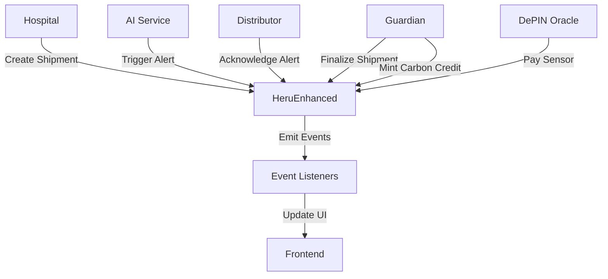

# Heru Smart Contracts 📜

This directory contains Solidity smart contracts for the Heru pharmaceutical cold chain management system on Hedera Hashgraph.

## 📁 Contract Files

```
contracts/
├── HeruEnhanced.sol        # Main contract with AI, ESG, and DePIN features
├── HeruNotary.sol          # Notarization and verification contract
└── SimpleHeruNotary.sol    # Simplified notary contract
```

## 🎯 Overview

Heru smart contracts provide:
- **Escrow Management**: Automated payment for compliant deliveries
- **AI Integration**: Smart alerts and reward freezing
- **ESG Features**: Carbon credit NFTs for green deliveries
- **DePIN Payments**: Automated sensor operator compensation
- **Compliance Verification**: Guardian-based compliance checking

## 📜 Contract Details

### **HeruEnhanced.sol**
The main smart contract powering Heru's advanced features.

**Solidity Version:** 0.8.19  
**License:** MIT  
**Dependencies:** OpenZeppelin Contracts

#### Key Features

##### 1. **Shipment Escrow System**
Hospitals deposit funds that are released to distributors upon compliant delivery.

```solidity
function createShipment(
    string memory _batchId,
    address _distributor,
    string memory _htsTokenId,
    string memory _hcsTopicId
) external payable
```

**Parameters:**
- `_batchId`: Unique batch identifier
- `_distributor`: Distributor's wallet address
- `_htsTokenId`: Hedera Token Service token ID
- `_hcsTopicId`: Hedera Consensus Service topic ID

**Escrow Amount:** Minimum 10 HBAR (configurable)

##### 2. **AI Alert System**
AI service can trigger alerts and freeze rewards for high-risk situations.

```solidity
function triggerAIAlert(
    string memory _batchId,
    uint256 _spoilageRisk,
    string memory _alertType,
    uint256 _freezeDurationMinutes
) external onlyAI
```

**Alert Types:**
- `TEMPERATURE`: Temperature violation
- `HUMIDITY`: Humidity out of range
- `LOCATION`: Unexpected location

**Risk Threshold:** Only freezes rewards if spoilage risk > 50%

**Freeze Duration:** Configurable in minutes

##### 3. **Carbon Credit NFTs (ESG)**
Distributors earn NFTs for carbon-negative deliveries.

```solidity
function mintCarbonCredit(
    string memory _batchId,
    uint256 _carbonSaved,
    string memory _verificationHash
) external onlyGuardian
```

**Benefits:**
- ERC-721 NFT minted to distributor
- Bonus payment of 5 HBAR (configurable)
- Verifiable carbon savings on-chain
- Guardian verification required

##### 4. **DePIN Sensor Payments**
Automated payments to IoT sensor operators for valid readings.

```solidity
function paySensorReading(
    address _sensorOperator,
    string memory _batchId,
    uint256 _timestamp,
    bytes32 _readingHash
) external onlyDePINOracle
```

**Payment Rate:** 0.01 HBAR per valid reading (configurable)

**Validation:** Oracle verifies reading authenticity

##### 5. **Shipment Finalization**
Guardian finalizes shipments after compliance verification.

```solidity
function finalizeShipment(
    string memory _batchId,
    bool _isCompliant
) external nonReentrant onlyGuardian
```

**Compliant Delivery:**
- Distributor receives reward
- Excess funds returned to hospital

**Non-Compliant Delivery:**
- Full refund to hospital
- No payment to distributor

#### Contract Roles

**Owner:**
- Deploy contract
- Update addresses
- Update rates
- Withdraw funds

**Trusted AI:**
- Trigger alerts
- Freeze rewards

**Guardian:**
- Verify compliance
- Finalize shipments
- Mint carbon credits

**DePIN Oracle:**
- Validate sensor readings
- Trigger payments

#### State Variables

```solidity
uint256 public defaultDeliveryReward = 10 ether; // 10 HBAR
uint256 public sensorPaymentRate = 0.01 ether;   // 0.01 HBAR
uint256 public carbonCreditValue = 5 ether;      // 5 HBAR

address public trustedAI;
address public guardian;
address public depinOracle;
```

#### Events

```solidity
event ShipmentCreated(string indexed batchId, address indexed payer, address indexed distributor, uint256 escrowAmount);
event AIAlertTriggered(string indexed batchId, uint256 spoilageRisk, string alertType, uint256 rewardFrozenUntil);
event AlertAcknowledged(string indexed batchId, address distributor, uint256 acknowledgedAt);
event CarbonCreditMinted(uint256 indexed tokenId, string batchId, address distributor, uint256 carbonSaved);
event SensorPaymentSent(address indexed sensorOperator, string batchId, uint256 amount);
event RewardUnfrozen(string indexed batchId, address distributor);
```

#### Security Features

- **ReentrancyGuard**: Prevents reentrancy attacks
- **Ownable**: Access control for admin functions
- **Role-based Access**: Separate roles for AI, Guardian, Oracle
- **Input Validation**: Comprehensive parameter checking
- **Frozen Reward Protection**: Prevents finalization during alerts

---

### **HeruNotary.sol**
Notarization contract for document and data verification.

**Features:**
- Document hash storage
- Timestamp verification
- Notary signatures
- Verification proofs

**Use Cases:**
- Temperature log notarization
- Compliance certificate verification
- Audit trail anchoring

---

### **SimpleHeruNotary.sol**
Simplified notary contract for basic verification needs.

**Features:**
- Lightweight implementation
- Basic hash storage
- Timestamp recording

**Use Cases:**
- Quick verification
- Testing and development
- Minimal gas usage scenarios

---

## 🚀 Deployment

### Prerequisites
- Hardhat development environment
- Hedera testnet account
- HBAR for gas fees

### Deployment Steps

1. **Install Dependencies**
   ```bash
   npm install
   ```

2. **Configure Hardhat**
   Edit `hardhat.config.js`:
   ```javascript
   module.exports = {
     solidity: "0.8.19",
     networks: {
       hedera: {
         url: "https://testnet.hashio.io/api",
         accounts: [process.env.PRIVATE_KEY]
       }
     }
   };
   ```

3. **Compile Contracts**
   ```bash
   npx hardhat compile
   ```

4. **Deploy to Hedera Testnet**
   ```bash
   npx hardhat run scripts/deploy.js --network hedera
   ```

5. **Verify Contract**
   ```bash
   npx hardhat verify --network hedera DEPLOYED_ADDRESS
   ```

### Deployment Script Example

```javascript
const { ethers } = require("hardhat");

async function main() {
  const HeruEnhanced = await ethers.getContractFactory("HeruEnhanced");
  
  const trustedAI = "0x...";      // AI service address
  const guardian = "0x...";        // Guardian address
  const depinOracle = "0x...";     // DePIN oracle address
  
  const heru = await HeruEnhanced.deploy(
    trustedAI,
    guardian,
    depinOracle
  );
  
  await heru.deployed();
  console.log("HeruEnhanced deployed to:", heru.address);
}

main();
```

## 🧪 Testing

### Run Tests
```bash
npx hardhat test
```

### Test Coverage
```bash
npx hardhat coverage
```

### Example Test
```javascript
describe("HeruEnhanced", function () {
  it("Should create shipment with escrow", async function () {
    const [hospital, distributor] = await ethers.getSigners();
    
    await heru.connect(hospital).createShipment(
      "BATCH-001",
      distributor.address,
      "0.0.12345",
      "0.0.67890",
      { value: ethers.utils.parseEther("10") }
    );
    
    const shipment = await heru.shipments("BATCH-001");
    expect(shipment.escrowAmount).to.equal(ethers.utils.parseEther("10"));
  });
});
```

## 📊 Gas Optimization

Contracts are optimized for gas efficiency:
- Efficient storage packing
- Minimal storage writes
- Batch operations where possible
- Event emission for off-chain indexing

## 🔒 Security Audits

**Status:** Pending professional audit

**Self-Audit Checklist:**
- ✅ Reentrancy protection
- ✅ Access control
- ✅ Input validation
- ✅ Integer overflow protection (Solidity 0.8+)
- ✅ Event emission
- ✅ Error handling

**Recommended Auditors:**
- OpenZeppelin
- ConsenSys Diligence
- Trail of Bits

## 📈 Contract Interactions



## 🔗 Integration

### Frontend Integration

```typescript
import { ethers } from 'ethers';
import HeruEnhancedABI from './HeruEnhanced.json';

const provider = new ethers.providers.Web3Provider(window.ethereum);
const signer = provider.getSigner();

const heruContract = new ethers.Contract(
  HERU_CONTRACT_ADDRESS,
  HeruEnhancedABI,
  signer
);

// Create shipment
await heruContract.createShipment(
  "BATCH-001",
  distributorAddress,
  "0.0.12345",
  "0.0.67890",
  { value: ethers.utils.parseEther("10") }
);
```

### Event Listening

```typescript
heruContract.on("ShipmentCreated", (batchId, payer, distributor, amount) => {
  console.log(`Shipment ${batchId} created with ${amount} HBAR`);
});
```

## 📚 Resources

- [Solidity Documentation](https://docs.soliditylang.org/)
- [OpenZeppelin Contracts](https://docs.openzeppelin.com/contracts/)
- [Hardhat Documentation](https://hardhat.org/docs)
- [Hedera Smart Contracts](https://docs.hedera.com/hedera/smart-contracts)

## 🤝 Contributing

When modifying contracts:
1. Follow Solidity style guide
2. Add comprehensive tests
3. Update documentation
4. Run security checks
5. Test on testnet before mainnet

## 📄 License

All contracts are licensed under MIT License.

---

**⚠️ Important**: These contracts handle real value. Always test thoroughly on testnet before mainnet deployment. Consider professional security audits for production use.
