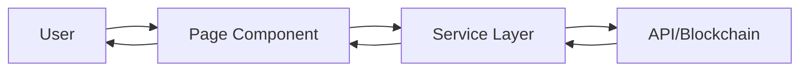

# Heru Pages 📄

This directory contains all page-level components that represent different routes in the Heru application.

## 📁 Page Files

```
pages/
├── Dashboard.tsx              # Main analytics dashboard
├── DataDashboard.tsx          # Data management dashboard
├── DivineSeal.tsx             # Blockchain sealing interface
├── Index.tsx                  # Home/landing page
├── IoTMonitoringPage.tsx      # IoT sensor monitoring
├── NotFound.tsx               # 404 error page
├── ShipmentDetails.tsx        # Detailed shipment view
├── Verification.tsx           # Medicine verification
├── VerificationPage.tsx       # Alternative verification UI
└── VerificationPage.tsx.backup # Backup file
```

## 🏠 Pages Overview

### **Index.tsx**
Landing page and application entry point.

**Route:** `/`

**Features:**
- Welcome screen
- Feature highlights
- Quick navigation
- Call-to-action buttons

**Usage:**
```typescript
import { Index } from '@/pages/Index';

// In router configuration
<Route path="/" element={<Index />} />
```

---

### **Dashboard.tsx**
Main analytics and monitoring dashboard.

**Route:** `/dashboard`

**Features:**
- Real-time statistics
- Active shipments overview
- Compliance metrics
- Recent activity feed
- Temperature monitoring charts
- Alert notifications

**Key Metrics Displayed:**
- Total batches tracked
- Active shipments
- Compliance rate
- Cost savings
- Patients protected
- Countries served

**Components Used:**
- LiveDashboard
- IoTDashboard
- DatabaseDashboard
- Charts and graphs

---

### **DataDashboard.tsx**
Data management and analytics interface.

**Route:** `/data-dashboard`

**Features:**
- Database statistics
- Storage performance
- Transaction history
- Batch records
- Export functionality

**Use Cases:**
- Data analysis
- Performance monitoring
- Historical data review
- Report generation

---

### **DivineSeal.tsx**
Blockchain sealing and verification interface.

**Route:** `/divine-seal`

**Features:**
- Secure data sealing
- IPFS integration
- Hedera consensus anchoring
- Verification proof generation
- Immutable record creation

**Workflow:**
1. Select batch data
2. Generate cryptographic hash
3. Upload to IPFS
4. Anchor to Hedera
5. Generate verification proof

**Components Used:**
- SacredVaultDashboard
- Smart contract integration
- IPFS service
- Hedera consensus service

---

### **Verification.tsx**
Medicine verification interface.

**Route:** `/verification`

**Features:**
- QR code scanning
- Batch ID input
- Temperature history display
- Compliance status
- Blockchain proof verification
- Certificate generation

**Verification Process:**
1. Scan QR code or enter batch ID
2. Fetch blockchain records
3. Verify temperature compliance
4. Display complete history
5. Generate verification certificate

**Components Used:**
- QRScanner
- VerificationService
- Temperature charts
- Compliance indicators

---

### **VerificationPage.tsx**
Alternative verification UI with enhanced features.

**Route:** `/verify`

**Features:**
- Modern UI design
- Enhanced QR scanning
- Detailed analytics
- Mobile-optimized
- Offline capability

---

### **IoTMonitoringPage.tsx**
Real-time IoT sensor monitoring interface.

**Route:** `/iot-monitoring`

**Features:**
- Live sensor readings
- Temperature graphs
- Humidity tracking
- Location monitoring
- Alert management
- Sensor health status

**Monitored Parameters:**
- Temperature (°C)
- Humidity (%)
- GPS location
- Battery level
- Signal strength

**Components Used:**
- IoTDashboard
- Real-time charts
- Alert notifications
- Sensor status indicators

---

### **ShipmentDetails.tsx**
Detailed view of individual shipments.

**Route:** `/shipment/:id`

**Features:**
- Complete shipment information
- Temperature timeline
- Location tracking
- Compliance checkpoints
- Blockchain transactions
- Document attachments

**Information Displayed:**
- Batch details
- Origin and destination
- Current status
- Temperature history
- Compliance status
- Blockchain proof
- Audit trail

**Components Used:**
- Temperature charts
- Location map
- Transaction history
- Document viewer

---

### **NotFound.tsx**
404 error page for invalid routes.

**Route:** `*` (catch-all)

**Features:**
- User-friendly error message
- Navigation links
- Return to home button

---

## 🗺️ Routing Structure

```typescript
// Example routing configuration
import { BrowserRouter, Routes, Route } from 'react-router-dom';

<BrowserRouter>
  <Routes>
    <Route path="/" element={<Index />} />
    <Route path="/dashboard" element={<Dashboard />} />
    <Route path="/data-dashboard" element={<DataDashboard />} />
    <Route path="/divine-seal" element={<DivineSeal />} />
    <Route path="/verification" element={<Verification />} />
    <Route path="/verify" element={<VerificationPage />} />
    <Route path="/iot-monitoring" element={<IoTMonitoringPage />} />
    <Route path="/shipment/:id" element={<ShipmentDetails />} />
    <Route path="*" element={<NotFound />} />
  </Routes>
</BrowserRouter>
```

## 🎨 Page Layout

All pages follow a consistent layout structure:

```typescript
export const PageTemplate = () => {
  return (
    <div className="min-h-screen bg-background">
      {/* Navigation */}
      <Navigation />
      
      {/* Page Header */}
      <header className="border-b">
        <div className="container mx-auto py-6">
          <h1 className="text-3xl font-bold">Page Title</h1>
        </div>
      </header>
      
      {/* Main Content */}
      <main className="container mx-auto py-8">
        {/* Page content */}
      </main>
      
      {/* Footer (optional) */}
      <footer>
        {/* Footer content */}
      </footer>
    </div>
  );
};
```

## 📱 Responsive Design

All pages are fully responsive:
- **Mobile**: Optimized for smartphones (320px+)
- **Tablet**: Enhanced layout for tablets (768px+)
- **Desktop**: Full-featured desktop experience (1024px+)
- **Large Screens**: Optimized for large displays (1440px+)

## 🔒 Protected Routes

Some pages require authentication:

```typescript
import { ProtectedRoute } from '@/components/ProtectedRoute';

<Route 
  path="/dashboard" 
  element={
    <ProtectedRoute>
      <Dashboard />
    </ProtectedRoute>
  } 
/>
```

## 🎯 Page-Specific Features

### Dashboard Features
- Real-time data updates
- Interactive charts
- Filterable tables
- Export functionality
- Alert notifications

### Verification Features
- QR code scanning
- Batch lookup
- Temperature validation
- Blockchain verification
- Certificate generation

### IoT Monitoring Features
- Live sensor data
- Historical graphs
- Alert thresholds
- Sensor management
- Data export

## 🧪 Testing Pages

```bash
# Navigate to specific pages in development
npm run dev

# Then visit:
http://localhost:5173/              # Index
http://localhost:5173/dashboard     # Dashboard
http://localhost:5173/verification  # Verification
http://localhost:5173/iot-monitoring # IoT Monitoring
```

## 📊 Data Flow



## 🎨 Styling

Pages use consistent styling:
- **Tailwind CSS**: Utility classes
- **shadcn/ui**: Component library
- **Custom CSS**: Page-specific styles
- **Responsive**: Mobile-first approach

## ♿ Accessibility

All pages implement:
- Semantic HTML
- ARIA labels
- Keyboard navigation
- Screen reader support
- Focus management
- Color contrast compliance

## 🚀 Performance

Pages are optimized for performance:
- Code splitting
- Lazy loading
- Image optimization
- Caching strategies
- Minimal re-renders

## 📝 Best Practices

### Component Structure
```typescript
import { useState, useEffect } from 'react';
import { useParams } from 'react-router-dom';

export const MyPage = () => {
  const { id } = useParams();
  const [data, setData] = useState(null);
  
  useEffect(() => {
    // Fetch data
  }, [id]);
  
  return (
    <div>
      {/* Page content */}
    </div>
  );
};
```

### Error Handling
```typescript
import { ErrorBoundary } from '@/components/ErrorBoundary';

<ErrorBoundary>
  <MyPage />
</ErrorBoundary>
```

### Loading States
```typescript
if (loading) return <Skeleton />;
if (error) return <ErrorMessage />;
return <PageContent />;
```

## 📚 Additional Resources

- [React Router Documentation](https://reactrouter.com/)
- [Tailwind CSS Documentation](https://tailwindcss.com/)
- [shadcn/ui Documentation](https://ui.shadcn.com/)

---

**Note**: Each page is designed to be self-contained and maintainable. Refer to individual page files for detailed implementation documentation.
