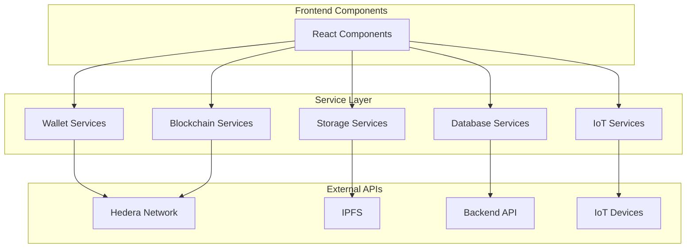

# Heru Services 🔧

This directory contains all business logic, API integrations, and external service connections for the Heru application.

## 📁 Service Files

```
services/
├── batchRegistryService.ts           # Medicine batch registration
├── consensusAnchoringService.ts      # Hedera consensus anchoring
├── contractService.ts                # Smart contract interactions
├── contractVerification.ts           # Contract verification logic
├── dataStorageComparisonService.ts   # Storage performance analysis
├── databaseService.ts                # Backend database operations
├── guardianIntegrationService.ts     # Hedera Guardian integration
├── hashUtils.ts                      # Cryptographic hash utilities
├── hashconnectService.ts             # HashConnect wallet service
├── hederaNativeService.ts            # Native Hedera SDK operations
├── hederaService.ts                  # Main Hedera service
├── heruContractService.ts            # Heru smart contract service
├── hfsService.ts                     # Hedera File Service
├── integrationTestService.ts         # Integration testing utilities
├── iotSimulationService.ts           # IoT sensor simulation
├── ipfsService.ts                    # IPFS storage service
├── medicineBatchFlowService.ts       # Medicine flow orchestration
├── mirrorNodeService.ts              # Hedera Mirror Node queries
├── modernWalletService.ts            # Modern wallet integration
├── realGuardianService.ts            # Real Guardian policy engine
├── sacredVaultOrchestrator.ts        # Vault orchestration
├── transactionMonitoringService.ts   # Transaction monitoring
├── verificationService.ts            # Medicine verification
└── walletService.ts                  # Wallet management
```

## 🔐 Blockchain Services

### **hederaService.ts**
Main Hedera Hashgraph integration service.

**Features:**
- Account management
- Transaction creation and submission
- Token operations (HTS)
- Consensus service (HCS)
- File service (HFS)

**Usage:**
```typescript
import { hederaService } from '@/services/hederaService';

// Create a transaction
const txId = await hederaService.createTransaction({
  type: 'TRANSFER',
  amount: 100,
  recipient: '0.0.12345'
});
```

### **hederaNativeService.ts**
Native Hedera SDK operations for advanced functionality.

**Features:**
- Direct SDK access
- Custom transaction building
- Advanced query operations
- Network configuration

### **guardianIntegrationService.ts**
Integration with Hedera Guardian policy engine.

**Features:**
- Policy creation and management
- Compliance verification
- Automated workflows
- Audit trail generation

**Usage:**
```typescript
import { guardianService } from '@/services/guardianIntegrationService';

// Verify compliance
const isCompliant = await guardianService.verifyCompliance(batchId);
```

### **consensusAnchoringService.ts**
Hedera Consensus Service (HCS) integration for immutable records.

**Features:**
- Topic creation
- Message submission
- Consensus timestamp retrieval
- Audit trail anchoring

## 💼 Smart Contract Services

### **heruContractService.ts**
Main service for interacting with Heru smart contracts.

**Features:**
- Contract deployment
- Function calls
- Event listening
- State queries

**Usage:**
```typescript
import { heruContractService } from '@/services/heruContractService';

// Create shipment
await heruContractService.createShipment({
  batchId: 'BATCH-001',
  distributor: '0x...',
  escrowAmount: 100
});
```

### **contractService.ts**
Generic smart contract interaction utilities.

### **contractVerification.ts**
Contract verification and validation logic.

## 💾 Storage Services

### **ipfsService.ts**
IPFS (InterPlanetary File System) integration for decentralized storage.

**Features:**
- File upload to IPFS
- Content retrieval
- Pinning service integration
- CID generation

**Usage:**
```typescript
import { ipfsService } from '@/services/ipfsService';

// Upload data to IPFS
const cid = await ipfsService.uploadData({
  batchId: 'BATCH-001',
  temperature: 4.5,
  timestamp: Date.now()
});
```

### **hfsService.ts**
Hedera File Service for on-chain file storage.

### **dataStorageComparisonService.ts**
Performance comparison between different storage solutions.

**Features:**
- IPFS vs HFS comparison
- Cost analysis
- Speed benchmarking
- Storage recommendations

## 🗄️ Database Services

### **databaseService.ts**
Backend database operations and API communication.

**Features:**
- CRUD operations for batches
- Transaction history
- Temperature readings
- Audit trail queries

**Usage:**
```typescript
import { databaseService } from '@/services/databaseService';

// Fetch all batches
const batches = await databaseService.getAllBatches();

// Get batch details
const batch = await databaseService.getBatchById('BATCH-001');
```

## 👛 Wallet Services

### **walletService.ts**
Comprehensive wallet management service.

**Features:**
- Wallet connection
- Account management
- Transaction signing
- Balance queries

**Usage:**
```typescript
import { walletService } from '@/services/walletService';

// Connect wallet
await walletService.connect();

// Get account info
const account = walletService.getAccount();
```

### **hashconnectService.ts**
HashConnect integration for Hedera wallet connections.

**Features:**
- QR code pairing
- Mobile wallet support
- Transaction approval
- Session management

### **modernWalletService.ts**
Modern wallet integration with WalletConnect support.

## 🌡️ IoT Services

### **iotSimulationService.ts**
IoT sensor simulation for testing and demonstration.

**Features:**
- Temperature sensor simulation
- Humidity monitoring
- GPS location tracking
- Alert generation

**Usage:**
```typescript
import { iotSimulationService } from '@/services/iotSimulationService';

// Start simulation
iotSimulationService.startSimulation('BATCH-001', {
  interval: 5000, // 5 seconds
  tempRange: [2, 8] // 2-8°C
});
```

## 📦 Medicine Batch Services

### **batchRegistryService.ts**
Medicine batch registration and management.

**Features:**
- Batch creation
- Tokenization (HTS)
- Metadata management
- Status tracking

**Usage:**
```typescript
import { batchRegistryService } from '@/services/batchRegistryService';

// Register new batch
const batch = await batchRegistryService.registerBatch({
  name: 'Vaccine Batch A',
  quantity: 1000,
  manufacturer: 'PharmaCo',
  expiryDate: '2025-12-31'
});
```

### **medicineBatchFlowService.ts**
Orchestrates the complete medicine batch lifecycle.

**Features:**
- Flow state management
- Stage transitions
- Compliance checks
- Event tracking

### **verificationService.ts**
Medicine verification and authenticity checking.

**Features:**
- QR code verification
- Blockchain proof validation
- Temperature history check
- Compliance verification

**Usage:**
```typescript
import { verificationService } from '@/services/verificationService';

// Verify medicine
const result = await verificationService.verifyBatch('BATCH-001');
console.log(result.isValid, result.temperatureCompliant);
```

## 🔍 Monitoring Services

### **transactionMonitoringService.ts**
Real-time blockchain transaction monitoring.

**Features:**
- Transaction tracking
- Status updates
- Receipt retrieval
- Error handling

### **mirrorNodeService.ts**
Hedera Mirror Node API integration for historical data.

**Features:**
- Transaction history
- Account queries
- Token information
- Topic messages

**Usage:**
```typescript
import { mirrorNodeService } from '@/services/mirrorNodeService';

// Get transaction details
const tx = await mirrorNodeService.getTransaction(txId);

// Get account transactions
const history = await mirrorNodeService.getAccountTransactions(accountId);
```

## 🧪 Testing Services

### **integrationTestService.ts**
Integration testing utilities and helpers.

**Features:**
- End-to-end test scenarios
- Mock data generation
- Service validation
- Performance testing

## 🛠️ Utility Services

### **hashUtils.ts**
Cryptographic hash utilities.

**Features:**
- SHA-256 hashing
- Data integrity verification
- Hash comparison
- Merkle tree operations

**Usage:**
```typescript
import { hashUtils } from '@/services/hashUtils';

// Hash data
const hash = hashUtils.sha256({
  batchId: 'BATCH-001',
  temperature: 4.5
});
```

### **sacredVaultOrchestrator.ts**
Orchestrates secure vault operations combining multiple services.

**Features:**
- Multi-layer security
- IPFS + Hedera integration
- Verification proofs
- Audit trails

## 🏗️ Service Architecture



## 📝 Best Practices

### Error Handling
All services implement comprehensive error handling:
```typescript
try {
  const result = await service.operation();
  return result;
} catch (error) {
  console.error('Operation failed:', error);
  throw new Error('User-friendly error message');
}
```

### Type Safety
All services use TypeScript interfaces:
```typescript
interface BatchData {
  batchId: string;
  name: string;
  quantity: number;
  // ...
}

async function registerBatch(data: BatchData): Promise<Batch> {
  // Implementation
}
```

### Async Operations
All external operations are asynchronous:
```typescript
// Good
const result = await service.fetchData();

// Bad
const result = service.fetchData(); // Missing await
```

## 🔒 Security Considerations

- **API Keys**: Never commit API keys or private keys
- **Input Validation**: All inputs are validated before processing
- **Error Messages**: Sensitive information not exposed in errors
- **Rate Limiting**: Implement rate limiting for API calls
- **Authentication**: Wallet-based authentication required

## 📚 Additional Resources

- [Hedera SDK Documentation](https://docs.hedera.com/hedera/sdks-and-apis)
- [IPFS Documentation](https://docs.ipfs.tech/)
- [Hedera Guardian Documentation](https://docs.hedera.com/guardian)

---

**Note**: All services are designed to be modular, testable, and maintainable. Refer to individual service files for detailed implementation documentation.
